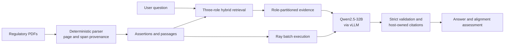

# RegModelTrace

**A local, auditable RAG system for regulatory technical documents.**

RegModelTrace traces a regulatory requirement through vendor methodology and reviewer evidence, then reports demonstrated alignment, unresolved gaps, and opportunities for stronger model governance. Its main design constraint is epistemic: every substantive claim must resolve to an exact source passage, and the system must not turn reviewer scrutiny, a documented update, or a retrieval miss into a stronger conclusion than the evidence supports.



The three source roles are kept distinct:

```text
REGULATOR: what is required?
VENDOR:    what does the documented method demonstrate?
REVIEWER:  what was examined, verified, or questioned?
```

## What is implemented

- deterministic PDF blocks, hierarchy, assertions, and exact source-span provenance;
- passage-level BM25+dense retrieval fanned out across regulator, vendor, and reviewer documents;
- local Qwen2.5-32B-Instruct-AWQ generation through vLLM;
- strict structured-output validation and host-resolved citations;
- a v2.2 forced-choice alignment interface for `SUFFICIENT/INSUFFICIENT` and `ALIGNED/PARTIALLY_ALIGNED/CONFLICT`;
- Ray execution with persistent GPU replicas and request/provenance accounting;
- a static evidence workbench that replays eight preserved RAG cases.

## Final results

The final KCC Test E remained untouched until the one authorized Base-Qwen run. It produced:

| Held-out KCC result | Outcome |
|---|---:|
| Clearly `ALIGNED` primary cases | 4/4 correctly classified |
| Truth `PARTIALLY_ALIGNED` primary cases | 0/2 correctly classified |
| Evidence sufficiency on six primary cases | 5/6 |
| Constructed insufficient-evidence controls | 6/6 correctly rejected |
| Primary two-stage joint correctness | 3/6 |

Across all five saved v2.2 fixtures, the descriptive primary totals were 23/30 correct sufficiency decisions, 21/29 correct conditional relations, and 18/30 joint decisions. All five truth-`PARTIALLY_ALIGNED` cases were predicted `ALIGNED`; there were no natural truth-`CONFLICT` cases. These clustered development/validation fixtures are not an independent-sample performance estimate.

Ray 2-GPU execution reached **2.004×** the Ray 1-GPU throughput on the frozen 4,096-request workload. Exact generative parity was 4,095/4,096 against Direct; the bounded diagnostic attributed the single changed label to an environment difference near a decision boundary. The systems lane therefore closed as `PASS_WITH_GENERATIVE_NONDETERMINISM_LIMITATION` while the historical exact-parity gate remained failed.

KCC narrative evidence remained reconstructable, while four excluded table panels retained `FAIL_TABLE_IDENTITY`.

See [final metrics](docs/final-metrics.md) and [limitations](docs/limitations.md) before interpreting these numbers.

## Demo

The static workbench shows the actual product interaction: question, bounded answer, evidence status, and exact source trail.

```bash
python -m http.server 8080 --directory demo
```

Open `http://localhost:8080`. The demo replays eight frozen development questions; it does not perform live inference or establish held-out performance.

## Local application contract

```python
from regmodeltrace import RegModelTrace

system = RegModelTrace()
result = system.ask("Did reviewer scrutiny establish a model modification?")
print(result["answer"])
print(result["status"])
print(result["evidence"])
```

The public result contains only:

```json
{
  "answer": "Evidence-backed prose with host-rendered markers [1].",
  "status": "SUPPORTED",
  "evidence": [
    {
      "id": "1",
      "document": "...",
      "document_role": "PROFESSIONAL_TEAM_REPORT",
      "page": 18,
      "quote": "...",
      "url": "https://...#page=18",
      "assertion_id": "...",
      "source_spans": []
    }
  ]
}
```

The historical model weights and retrieval indexes are intentionally absent from GitHub. To run the full service, supply the external artifacts described in `regmodeltrace/config/system_v1.json`, set `REGMODELTRACE_MODEL_PATH` and `REGMODELTRACE_EMBEDDING_MODEL_PATH`, then run:

```bash
python -m regmodeltrace serve
```

The compact repository can still verify the public contract without model weights:

```bash
python -m unittest discover -s regmodeltrace/tests -v
python scripts/verify_release.py
```

## Repository map

```text
regmodeltrace/   application, parser, evidence, retrieval, vLLM and Ray code
demo/            static evidence workbench with preserved source-bound cases
docs/            architecture, metrics, limitations, and project narrative
artifacts/       compact final reports, receipts, matrices, and Gold Core sample
openspec/        durable system contracts and final release decisions
```

## Release boundary

```text
TEST_E = CLOSED
PROJECT_TECHNICAL_DEVELOPMENT = CLOSED
FINAL_MODEL = Base Qwen
FINE_TUNING = NOT_JUSTIFIED
RERUN = NOT_AUTHORIZED
```

This repository is a compact review package. Raw PDFs, model weights, SQLite indexes, embedding matrices, cluster attempts, and superseded experiments were excluded from Git history. Consequently, the included reports substantiate the completed evaluations, while the GitHub snapshot alone cannot replay the historical GPU runs.

## License

Code is released under the [MIT License](LICENSE). Source documents and quoted excerpts retain their original ownership and terms.
