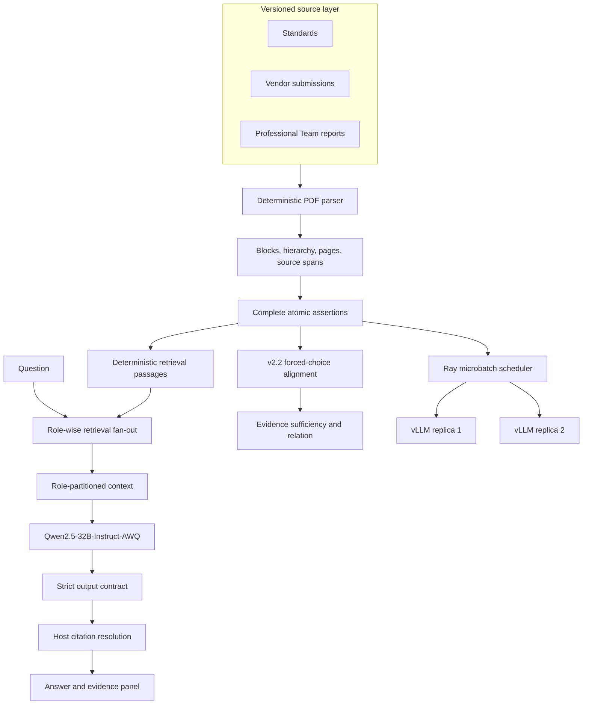

# Architecture

## Product pipeline



## Ownership boundaries

| Layer | Owns | Does not establish |
|---|---|---|
| Parser | document identity, page, text, geometry, hierarchy | semantic meaning or compliance |
| Assertion builder | complete attributable propositions and exact spans | evidentiary role |
| Retriever | question-conditioned passage ranking | corpus absence or answer truth |
| Qwen/vLLM | evidence-conditioned classification and synthesis | source identity, citation metadata, causality not stated by sources |
| Host | schema validation, request binding, citations, failure accounting | hidden vendor implementation |
| Human adjudicator | frozen documentary truth and substantive acceptance | deployed behavior beyond the evidence scope |

## Alignment model

```text
requirement
  -> applicable facets and alternatives
  -> vendor demonstration
  -> reviewer coverage
  -> evidence sufficiency
  -> ALIGNED / PARTIALLY_ALIGNED / CONFLICT
```

Reviewer evidence is stored separately from vendor demonstration. `NOT_DEMONSTRATED` means the bounded evidence does not establish a facet; it does not assert that the implementation lacks it. Causal claims require an explicit source link or a separately designed causal study.

## Scale path

Ray schedules independent vLLM replicas over immutable request manifests. Each response retains request ID, source hash, prompt token IDs, actor identity, terminal disposition, and attempt journal. The 2-GPU result demonstrated throughput scaling, while one environment-sensitive generative decision prevents an exact-determinism claim.

